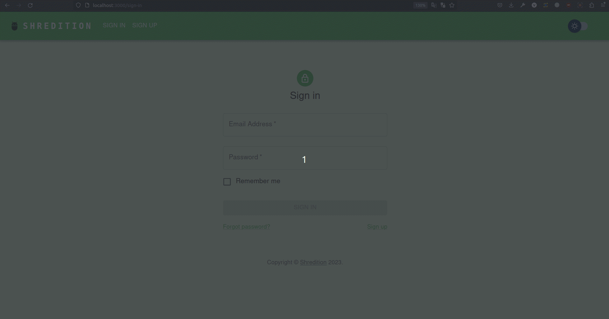

# React App with JWT Authorization and Authentication

This project is a React application created using the `create-react-app` npm package.
Its goal is to implement a basic authorization and authentication strategy using JSON Web Tokens (JWT).

## Demo

In this repo only front-end is implemented.

[Backend Repository](https://github.com/zwanzigg/express-basic)



## Setup

Before starting the app, you need to set up the environment variables by following these steps:

1. Locate the `sample.env` file in the project directory.
2. Create a new file named `.env` in the same directory.
3. Copy the contents of `sample.env` into `.env`.
4. Fill in the necessary environment variables inside the `.env` file. These variables might include secret keys, API
   endpoints, or other configuration details required for JWT authentication.

## Installation

To install the dependencies and run the React app, please follow these steps:

1. Ensure that you have Node.js installed on your machine.
2. Open a terminal and navigate to the project directory.
3. Run the following command to install the dependencies:

   ```shell
   npm install
   ```

4. After the installation is complete, start the React development server with the following command:

   ```shell
   npm start
   ```

5. The app should now be running in your browser at `http://localhost:3000`. Any changes you make to the source code will automatically trigger a refresh in the browser.

## Implemented Features

This React app already provides a basic structure and components to implement authorization and authentication using JWT. The following steps are already implemented and ready to use:

1. Set up linting and formatting using ESLint and Prettier.
2. Set up React Router.
3. Registration form with fields validation: Allows users to sign up and create an account.
4. Login form: Authenticates users and generates a JWT upon successful login.
5. The generated JWT is stored in local storage.
6. Protected routes: Includes an example protected route (/Home, /Profile) that requires a valid JWT for access.
7. Logout mechanism: Allows users to log out and clears the stored JWT.
8. Theme switcher: Allows users to switch between light and dark themes.
9. Toast notifications: Displays success and error messages to the user.

## Features to implement:
1. Secure token storage.
2. Refresh token.
3. Password reset.
4. Email verification.
5. Throttle login attempts.
6. Add tests.
7. Add Dockerfile.
8. Add CI/CD pipeline.

## Libraries used:

1. React
2. Material UI
3. react-hook-form
